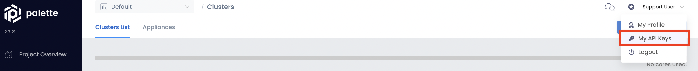
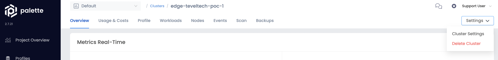

## Instructions
1. `cd edge/`
2. Rename `terraform.example.tfvars` to `terraform.tfvars`
    ```
    mv terraform.example.tfvars terraform.tfvars
    ```
4. Add `API Token` from your Spectro Cloud Palette Tenant to `terraform.tfvars`
    [](./docs/img/palette-api-token.png)
5. Modify `cluster.tf` file
   1. Change the `name` of the cluster in line5
   2. Change the _server name_ under `edge_server` in line24
   3. Change the `uuid`, to the one given by the bootstrapped machine, in line25
   4. If you need to add _Cluster Profiles_ you can do it within the `Cluster Profile` object from line30
6. Create the cluster with Terraform
   1. `terraform init`
   2. `terraform apply`
7. To delete the cluster
   1. Delete the cluster in Palette first
   [](./docs/img/delete-cluster.png)
   2. `terraform destroy`